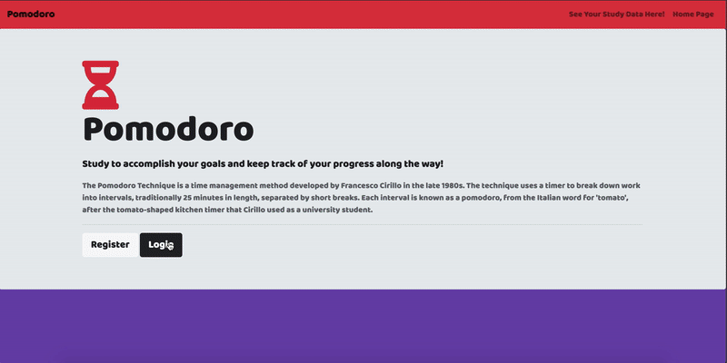

# Pomodoro Study
Pomodro Web Application To Help You Study! Built With JavaScript, Node.js, Express.js, MongoDB, EJS, HTML, CSS, and a few other tools and packages. Site is deployed here using Heroku and MongoDB Atlas http://pomodorostudy.herokuapp.com/

## Gif Of Usage

## Installation and Setup Instructions

Clone down this repository. You will need `node` , `npm` and `mongoDB` installed globally on your machine.  

Installation:

`npm i`

To Start Server:

Open A new terminal session and run `mongod`, and run `node app.js` in the project directory

To Visit App:

`localhost:3000`

## Reflection

- I use the pomodoro technique daily to study/ do work, there are many sites for practicing this technique, but none of them allow the user to save and see their progress visually. Seeing progress and the hard work you've put into something is a great motivator for continuing success. 

- This was a huge learning experience because it's the first time i've built an application of this scale, and one of the main challenges I ran into was authentication.

- After a few days of research and reading documentation I decided to use the local strategy Passport.js for authentication, and express-session for creating cookies and sessions.

- The entire list of technologies used here are, JavaScript, HTML, CSS, Passport.js, EJS, Node.js, Express.js, express-session, Mongoose, MongoDB, Lodash, and a few other NPM packages.
